# Soumya Ranjan Nanda

Backend Engineer | AI & Systems | Java

---

## About

<table>
<tr>
<td width="65%">

I'm a Computer Science undergraduate at **OUTR, Bhubaneswar** with an interest in backend engineering, distributed systems and AI.

Most of my work revolves around Java, Spring Boot and modern web technologies. Recently I've been exploring system design, DevOps and large language models while continuing competitive programming in Java.

**Education**

- B.Tech CSE (AI/ML), OUTR
- CGPA: **8.9/10**

**Current Focus**

- Spring Boot
- Distributed Systems
- AI Applications
- System Design

</td>

<td align="center">

</td>
</tr>
</table>

---

## Explore

<table>
<tr>

<td align="center" width="250">

 

Project documentation and case studies

</td>

<td align="center" width="250">

 

Notes, roadmaps and resources

</td>

<td align="center" width="250">

 

Coursework and certifications

</td>

</tr>
</table>

---

## Featured Projects

<table>
<tr>
<td></td>
<td></td>
</tr>

<tr>
<td></td>
<td></td>
</tr>

<tr>
<td></td>
<td></td>
</tr>
</table>

---

## Tech Stack

**Languages**

**Frameworks**

**Databases**

**Tools**

---

## GitHub Analytics

  

---

  

