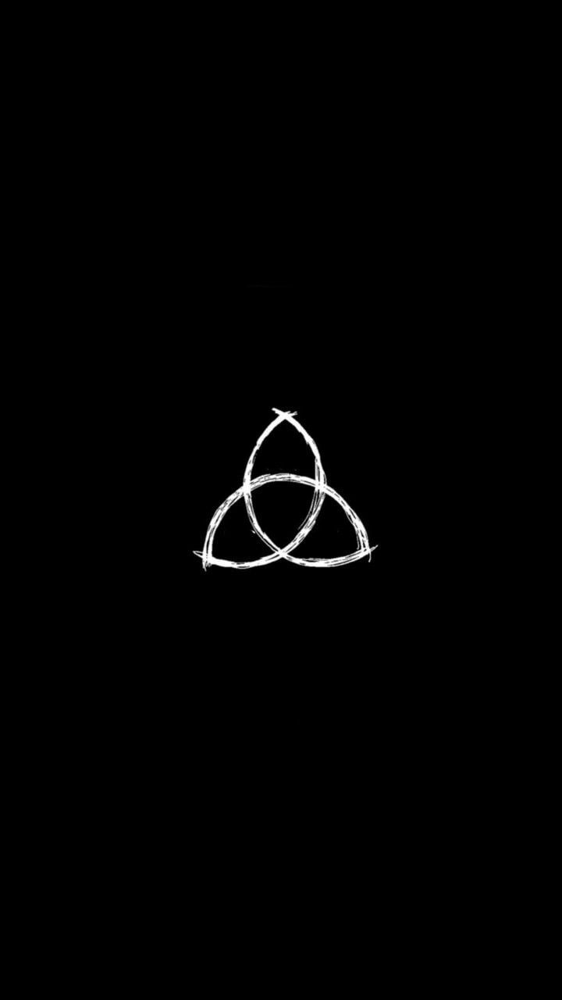

# Soumya Ranjan Nanda

Backend Engineer | AI & Systems | Java

---

## About

<table>
<tr>
<td width="70%">

I'm a Computer Science undergraduate at **OUTR, Bhubaneswar**, focused on backend engineering, distributed systems and AI.

Most of my work is in Java and Spring Boot. Lately I've been going deeper into system design, DevOps and LLMs — alongside competitive programming.

**Education** — B.Tech CSE (AI/ML), OUTR · CGPA **8.9/10**
**Currently exploring** — Spring Boot · Distributed Systems · AI Applications · System Design

</td>
<td align="center" width="30%">

</td>
</tr>
</table>

---

<table>
<tr>
<td align="center" width="30%">

</td>
<td width="70%">

### Beyond code

Outside of engineering, I'm learning Japanese with my sights set on **JLPT N2**, and I try to keep reading consistently — small habits, kept up over time.

</td>
</tr>
</table>

---

## Explore

<table>
<tr>
<td align="center" width="220">

 Project documentation and case studies
</td>
<td align="center" width="220">

 Notes, roadmaps and resources
</td>
<td align="center" width="220">

 Coursework and certifications
</td>
</tr>
</table>

---

## Tech Stack

**Languages**

**Frameworks**

**Databases**

**Tools**

---

## Activity

---

## GitHub Analytics

---

